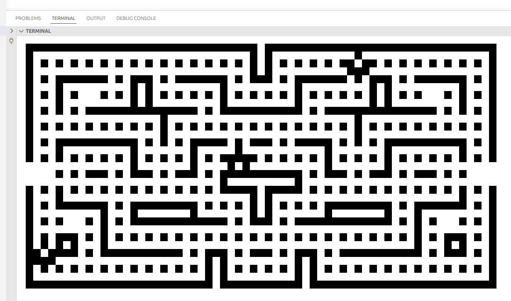
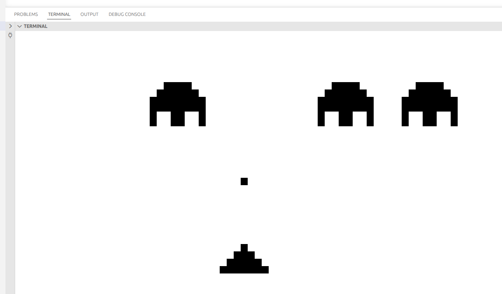

# RustyChip8Vm

A CHIP-8 emulator written in Rust.

## What is CHIP-8?

CHIP-8 is an interpreted programming language developed in the 1970s for early microcomputers. It was designed to make it easier to write and run simple games and programs on systems with limited resources. CHIP-8 programs, often called ROMs, run on a virtual machine with a simple architecture including a 64x32 pixel display, 16 keys, and basic sound capabilities.

## Motivation

This project was created as an exercise in learning Rust. Implementing a CHIP-8 emulator provides a great opportunity to explore low-level programming concepts, memory management, and graphics rendering in a modern, safe language like Rust.

## Features

- Full CHIP-8 instruction set implementation
- Terminal-based graphics using ASCII characters
- Audio support for CHIP-8 beep sounds
- Support for loading and running CHIP-8 ROMs

## Usage

### Prerequisites

- Rust (latest stable version recommended)

- **Linux Audio Support** (Linux only): The emulator includes audio support for CHIP-8 beep sounds. To build successfully on Linux, you need the ALSA development libraries installed.

  If you see build errors like "the system library `alsa` required by crate `alsa-sys` was not found," install the ALSA development package:

  ```bash
  sudo apt update
  sudo apt install libasound2-dev
  ```

  This is necessary because the audio library (Rodio, via CPAL) needs to communicate with the Linux sound system, even though the code is written in Rust.

### Building

Clone the repository and build with Cargo:

```bash
cargo build --release
```

### Running

Run the emulator with a CHIP-8 ROM file:

```bash
cargo run --release <path_to_rom>
```

For example, for running the game space invaders

```bash
cargo run --release games/INVADERS
```

**Note**: Not all terminal emulators support the graphics rendering correctly. If you experience display issues, try running the emulator in a different terminal.

### Controls

The CHIP-8 keypad is mapped to keyboard keys:

- 1 2 3 4
- Q W E R
- A S D F
- Z X C V

## Inspired by the Book "Computer Science From Scratch" by David Kopec
https://davekopec.com/

You can find out more about the book here: https://computersciencefromscratch.com/

## Screenshots

### Blinky Game


### Space Invaders


## License

This project is open source. See individual ROM files for their respective licenses.